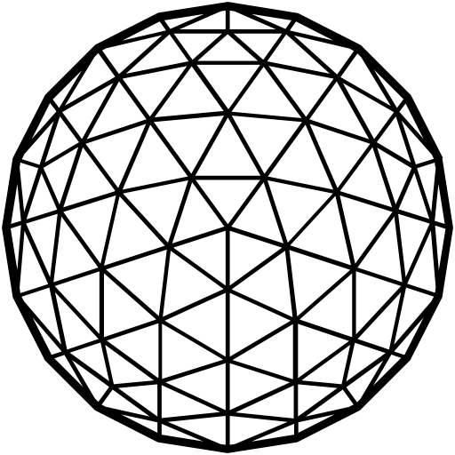

# Brand kit

## Logo

### Mars Text Logo

<figure><figcaption>
Mars Text Logo
</figcaption></figure>

Download

* [SVG](https://raw.githubusercontent.com/mars-protocol/mars-gitbook/refs/heads/main/.gitbook/assets/Logo.svg)
* [PNG](https://raw.githubusercontent.com/mars-protocol/mars-gitbook/refs/heads/main/.gitbook/assets/Logo.png)

***

### Mars Logo Detailed

<figure><figcaption>
Mars Logo Detailed
</figcaption></figure>

Download

* [SVG](https://raw.githubusercontent.com/mars-protocol/mars-gitbook/refs/heads/main/.gitbook/assets/MarsLogo.svg)
* [PNG](https://raw.githubusercontent.com/mars-protocol/mars-gitbook/refs/heads/main/.gitbook/assets/MarsLogo.png)

***

### Mars Grid Logo Detailed

<figure><figcaption>
Mars Grid Logo Detailed
</figcaption></figure>

Download

* [SVG](https://raw.githubusercontent.com/mars-protocol/mars-gitbook/refs/heads/main/.gitbook/assets/Mars.svg)
* [PNG](https://raw.githubusercontent.com/mars-protocol/mars-gitbook/refs/heads/main/.gitbook/assets/Mars.png)

***

### Mars Logo Simplified

<figure><figcaption>
Mars Logo Simplified
</figcaption></figure>

Download

* [SVG](https://raw.githubusercontent.com/mars-protocol/mars-gitbook/refs/heads/main/.gitbook/assets/mars.svg)
* [PNG](https://raw.githubusercontent.com/mars-protocol/mars-gitbook/refs/heads/main/.gitbook/assets/mars.png)

***

### Grid Logo Simplified

<figure><figcaption>
Grid Logo Simplified
</figcaption></figure>

Download

* [SVG](https://raw.githubusercontent.com/mars-protocol/mars-gitbook/refs/heads/main/.gitbook/assets/mars-grid.svg)
* [PNG](https://raw.githubusercontent.com/mars-protocol/mars-gitbook/refs/heads/main/.gitbook/assets/mars-grid.svg)

***

## Wallpapers

### Mars

<figure><figcaption></figcaption></figure>

Download&#x20;

* [1920x1080](https://raw.githubusercontent.com/mars-protocol/mars-gitbook/refs/heads/main/.gitbook/assets/mars-protocol-1920x1080.png)
* [3600x1600](https://raw.githubusercontent.com/mars-protocol/mars-gitbook/refs/heads/main/.gitbook/assets/mars-protocol-3600x1600.png)

### Mars Clean

***

<figure><figcaption></figcaption></figure>

Download&#x20;

* [1920x1080](https://raw.githubusercontent.com/mars-protocol/mars-gitbook/refs/heads/main/.gitbook/assets/mars-protocol-clean-1920x1080.png)
* [3600x1600](https://raw.githubusercontent.com/mars-protocol/mars-gitbook/refs/heads/main/.gitbook/assets/mars-protocol-clean-3600x1600.png)

***

### Grid

<figure><figcaption></figcaption></figure>

Download&#x20;

* [1920x1080](https://raw.githubusercontent.com/mars-protocol/mars-gitbook/refs/heads/main/.gitbook/assets/mars-protocol-grid-1920x1080.png)
* [3600x1600](https://raw.githubusercontent.com/mars-protocol/mars-gitbook/refs/heads/main/.gitbook/assets/mars-protocol-grid-3600x1600.png)

***

### Grid Clean

<figure><figcaption></figcaption></figure>

Download&#x20;

* [1920x1080](https://raw.githubusercontent.com/mars-protocol/mars-gitbook/refs/heads/main/.gitbook/assets/mars-protocol-grid-clean-1920x1080.png)
* [3600x1600](https://raw.githubusercontent.com/mars-protocol/mars-gitbook/refs/heads/main/.gitbook/assets/mars-protocol-grid-clean-3600x1600.png)

