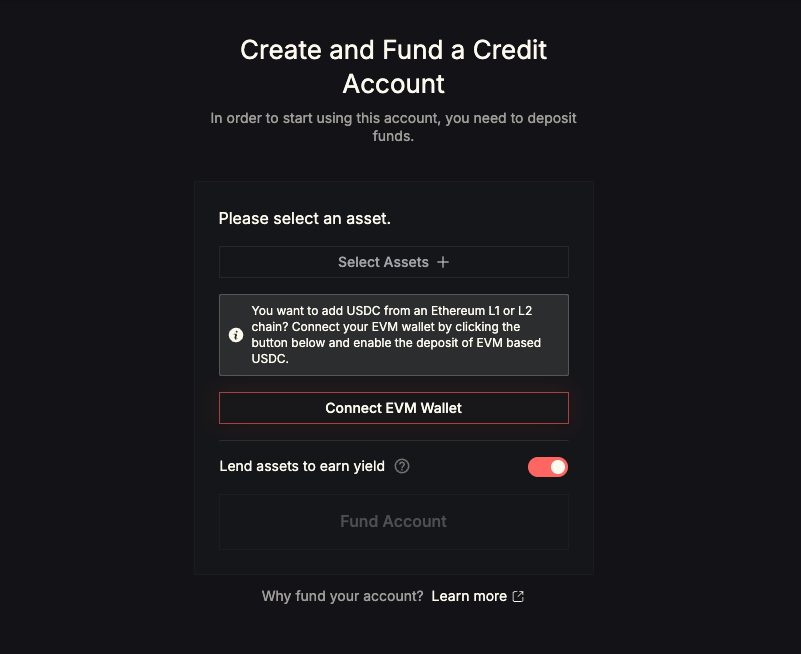
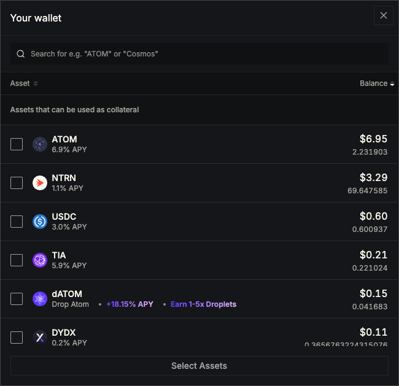
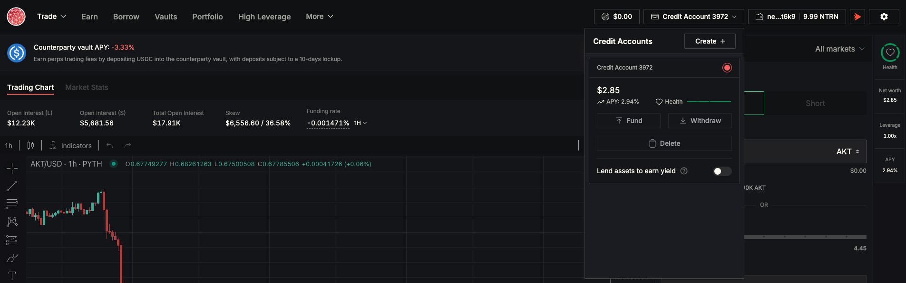
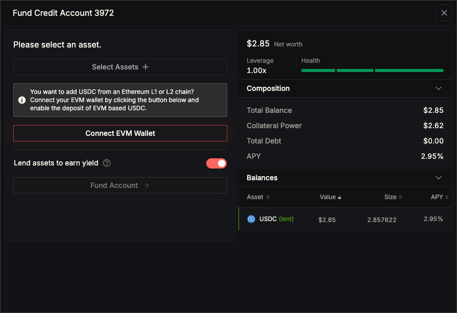
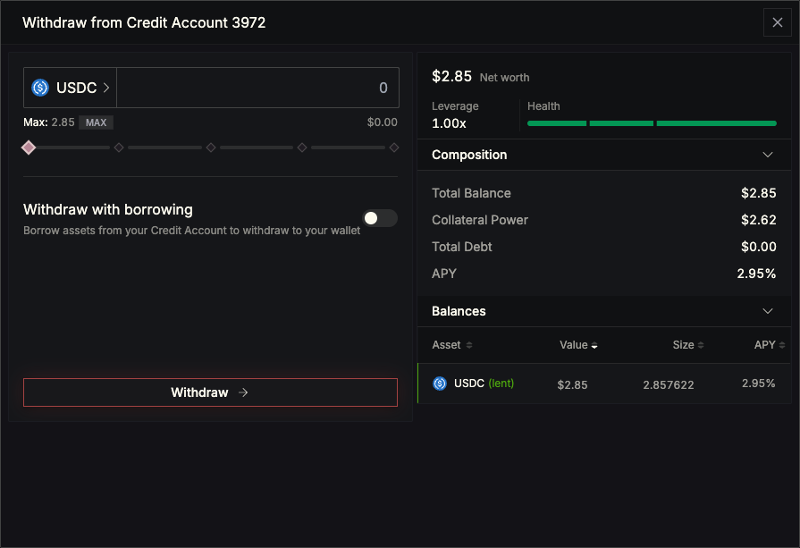
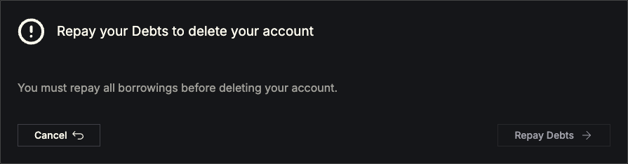
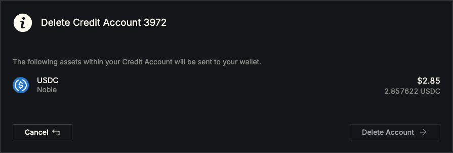

# Using a Credit Account

Introduction

In order to interact with Mars Protocol V2 and access all features (see [Credit Accounts](../credit-accounts.md)) you must first create a Credit Account.

***

## 1. Create & Fund an Account

If you don’t yet have a Credit Account, you’ll be taken straight to the **Create and Fund a Credit Account** page:

<figure><figcaption>
Create and Fund a Credit Account
</figcaption></figure>

* **Optionally connect an EVM wallet** to deposit USDC from an Ethereum or L2 chain
* **Select your collateral assets**
  * Click **Select Assets +** to open the asset selector.
  * Whitelisted collateral appears at the top and non-whitelisted assets appear below (see the [Lending & Borrowing](../lending-and-borrowing.md) page).

<figure><figcaption>
Asset selector modal
</figcaption></figure>

* **Choose deposit amounts** and click **Fund Account**.
  * After confirming the on-chain transaction, you’ll be redirected back to the app and see your new Credit Account in the navbar:

***

## 2. Create Additional Accounts

To open more than one Credit Account:

1. Click the **Credit Account** dropdown in the navbar.
2. Click **Create +** and you will be forwarded to the [Create & Fund](using-a-credit-account.md#id-1.-create-and-fund-an-account) page.

***

## 3. Manage Your Credit Accounts

Once you have one or more Credit Accounts, you can **Fund**, **Withdraw**, or **Delete** any of them from the same navbar dropdown:\

<figure><figcaption></figcaption></figure>

### 3.1 Fund an Existing Account

* Open the **Credit Account** dropdown and click **Fund**.
* In the **Fund Credit Account** modal, select assets and amounts (same flow as initial funding) and click **Fund Account**.

<figure><figcaption></figcaption></figure>

### 3.2 Withdraw from Your Account

* From the **Credit Account** dropdown, click **Withdraw**.
* In the Withdraw modal, choose asset and amount (use slider or **MAX**) and then click **Withdraw →.**

<figure><figcaption></figcaption></figure>

### 3.3 Delete a Credit Account

* Open the **Credit Account** dropdown and click **Delete**.

<figure><figcaption></figcaption></figure>

* If you have outstanding debt or open Perps positions, you’ll first see a **Repay Debts** prompt:
* Once clear, you’ll see your remaining assets summary, click **Delete Account** to withdraw them back to your wallet and close the account:

<figure><figcaption></figcaption></figure>
