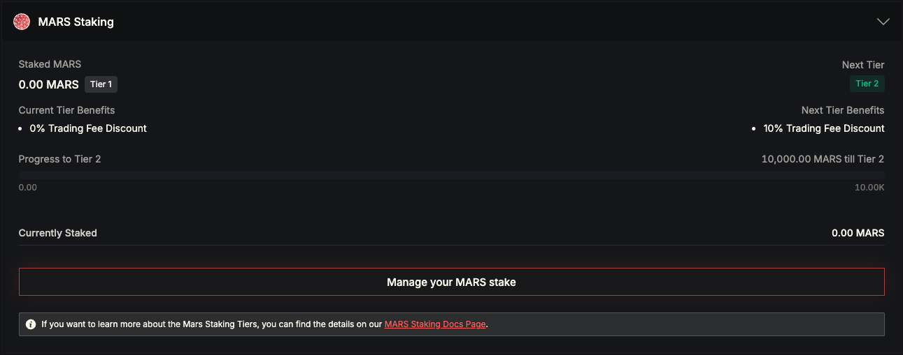
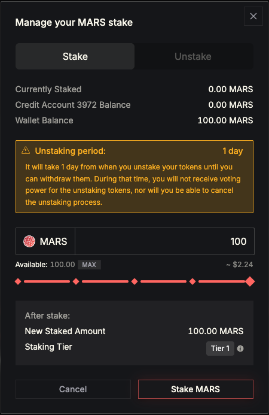

# MARS Staking

Staking MARS allows you to participate in protocol governance and unlock trading fee discounts through the MARS staking tiers system.

You need to have **MARS in your wallet on the Neutron network** in order to stake. Once staked, your tokens are locked in the protocol and no longer directly available in your wallet until you unstake them.

***

### How to Stake MARS

1. Go to the Mars Protocol frontend: [app.marsprotocol.io/portfolio](https://app.marsprotocol.io/portfolio)
2. Navigate to the **MARS Staking** section within the Portfolio page.
3.  Click **Manage your MARS stake**.\

    <figure><figcaption></figcaption></figure>
4. A pop-up interface will appear, where you can:
   * **Stake**: Select how much MARS to stake using the slider or input field.
   * **Unstake**: Select how much MARS to unstake.
5. Click **Stake MARS** or **Unstake MARS**, then confirm the transaction in your wallet.\
   

**Unstaking period**: It takes **1 day** after initiating an unstake before you can withdraw tokens. During this time:

* You will not receive trading fee discounts & voting power for the unstaking tokens.
* You cannot cancel the unstaking process.

***

### MARS Staking Tiers

By staking MARS, you qualify for trading fee discounts (spot and perpetuals) based on your staked amount. The tiers are designed around real holder distributions, ensuring both **fair access** and **meaningful rewards** for larger commitments.

| Tier   | MARS Staked | Trading Fee Discount |
| ------ | ----------- | -------------------- |
| Tier 1 | < 10,000    | 0%                   |
| Tier 2 | 10,000+     | 10%                  |
| Tier 3 | 50,000+     | 20%                  |
| Tier 4 | 100,000+    | 30%                  |
| Tier 5 | 250,000+    | 45%                  |
| Tier 6 | 500,000+    | 60%                  |
| Tier 7 | 1,000,000+  | 70%                  |
| Tier 8 | 1,500,000+  | 80%                  |

**Important Note:** You can start staking MARS today to secure your tier, and be ready when trading fee discounts launch in October.

***

### Utility of Staking

* **Governance**: Gain voting power on community and contributor proposals.
* **Fee Discounts**: Unlock reduced trading fees across spot and perpetuals.
* **Protocol Alignment**: Support the ecosystem through long-term commitment.

***
