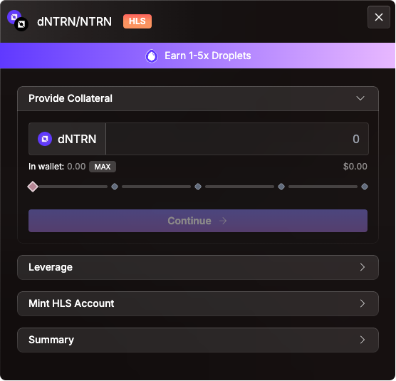

# High Leverage Strategies

These strategies rely on strict collateral-debt pairings of **highly correlated assets**, such as **liquid staking tokens (LSTs)** and their **underlying base assets** (e.g., dATOM and ATOM).

By utilizing asset pairs with strong price correlation, HLS Accounts allow for **higher leverage ratios** compared to standard Credit Accounts - while preserving overall protocol stability.

<figure><figcaption></figcaption></figure>

Unlike standard Credit Accounts, **HLS Accounts** are **limited to borrowing only highly correlated assets**. Upon depositing a collateral asset into an HLS Credit Account, only a small, predefined set of matching assets can be borrowed. This restriction is based on the assumption that these assets **move in price together**, reducing systemic risk.

For example:

* A user deposits **ATOM** into an HLS Credit Account.
* From this point forward, only **ATOM, stATOM**, or **dATOM** can be borrowed against it.
* Because of the high correlation, users can borrow up to **6× the value** of their collateral.

This mechanism unlocks powerful leverage potential—particularly with **liquid staking derivatives (LSDs)**, which are prevalent in the Cosmos ecosystem.

***

### LSDs in the Cosmos Ecosystem

Cosmos-native protocols such as **Stride** and **Drop** offer LSDs (e.g., stATOM, dATOM, stTIA), which represent staked tokens that continue to accrue staking rewards (APY). These LSDs are supported with deep liquidity across Neutron and Osmosis via platforms like **Astroport** and **Osmosis DEX**.

#### Example:

* A user deposits **dATOM** into an HLS Credit Account.
* Only **ATOM** can be borrowed against this position, since ATOM is the base asset of dATOM.

***

### Case Study: The ATOM Scenario

To illustrate, let’s assume **ATOM's price remains constant** over one year.

#### Baseline Performance

The APYs are the current APYs at the time of writing and will be different at the time of reading this guide.

| Strategy              | Initial Value | APY    | End Value | Profit |
| --------------------- | ------------- | ------ | --------- | ------ |
| Lend ATOM in Red Bank | $100          | 5.06%  | $105.06   | $5.06  |
| Hold dATOM (staking)  | $100          | 14.88% | $114.88   | $14.88 |

#### High Leverage Strategy (HLS)

1. Deposit **$100 of dATOM** as collateral.
2. Borrow **$600 of ATOM** (6× leverage).
3. Swap to **dATOM** (assuming a 1% slippage on the swap = $6 loss).
4. User now holds **$694 of dATOM**.

Over one year:

* **Borrow cost:** $600 × 10.29% = $61.74
* **Staking gain:** $694 × 14.88% = $103.27
* **Net Profit:** $103.27 – $61.74 = **$41.53**
* **Effective APY:** **41.53%** on initial $100

> This strategy is profitable **only** as long as the staking APY > borrow APY.

***

### Risk Factors in HLS

While potentially lucrative, High Leverage Strategies come with **significant risks**:

#### 1. **Swap Slippage**

Closing an HLS position requires converting LSDs back to base assets. Depending on position size and market conditions, swap slippage may erode profits. Users can mitigate this by **deleveraging gradually**.

#### 2. **LSD Depegging**

LSDs depend on accurate redemption rates from providers (e.g., Stride, Drop). Failure in these mechanisms may cause depegging, exposing users to liquidation risk - even without price movement.

#### 3. **Volatile Borrow Rates**

Borrow APYs are dynamic and can spike unexpectedly. An HLS position must be **actively monitored**, and is not suited for passive investment styles.
