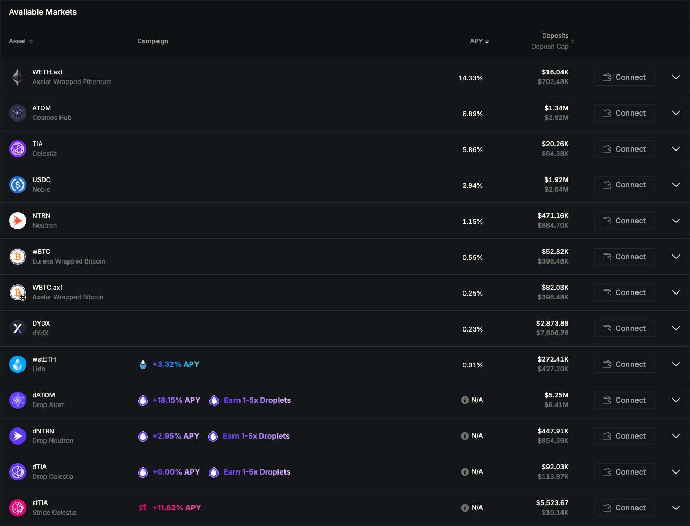

# Lending & Borrowing

Users can earn yield by supplying assets to the protocol or borrow assets to pursue leveraged strategies. The system is governed by a dynamic interest rate model and risk-managed asset whitelisting.

<figure><figcaption></figcaption></figure>

### Interest Rate Model

Mars Protocol employs a **two-slope utilization-based interest rate model**, inspired by proven designs from protocols such as Aave. This model balances supply and demand to ensure optimal capital efficiency and risk mitigation.

#### How It Works

The model defines two distinct utilization zones:

* **Slope 1: Low to Optimal Utilization**
  * Interest rates increase **gradually** as utilization rises.
  * Encourages borrowing and keeps costs low when liquidity is abundant.
* **Slope 2: Optimal Utilization to 100%**
  * Interest rates increase **steeply** to discourage further borrowing as liquidity becomes constrained.

<figure><figcaption></figcaption></figure>

| Rate Component    | Description                                                                                    |
| ----------------- | ---------------------------------------------------------------------------------------------- |
| **Borrowing APR** | Increases with utilization. Borrowers pay interest to the pool.                                |
| **Lending APR**   | Derived from Borrowing APR, distributed across lenders. Always lower due to protocol reserves. |

The protocol aims to keep each asset’s utilization **around the optimal level**, maximizing capital efficiency without compromising system solvency.

***

### Asset Whitelisting & Lending Restrictions

To maintain system security and reliability, Mars enforces **asset-level permissions**:

* **Only whitelisted assets** can be deposited or borrowed.
* **Not all whitelisted assets are borrowable.**
  * Example: **Liquid Staking Tokens (LSTs)** are generally **non-borrowable** due to their **price manipulation risk** via redemption mechanisms.

If an asset cannot be borrowed:

* It will have **no Borrow APR**.
* It may still be deposited and **lent out** (e.g., as passive liquidity).

***

### Lending Features

Mars offers users several mechanisms to earn passive income through lending:

#### Deposit Caps

* Every whitelisted asset is subject to a **deposit cap**, limiting the maximum allowable supply.
* Caps apply regardless of borrowability.
* Users can view:
  * **Current deposits**
  * **Remaining capacity**
  * Details in the **Risk Parameters** section

#### Auto-Lend Toggle

* Located in the **Credit Account interface**
* When enabled, **all deposited assets are automatically lent**
* Provides a **hands-free yield generation** mechanism
* Ideal for users seeking to maximize utilization without manual management

***

### Borrowing Features

The borrowing system is built to support **flexibility, transparency, and control**.

#### Borrowing Options

Users can borrow in two ways:

| Method                | Effect                                                          |
| --------------------- | --------------------------------------------------------------- |
| **To Wallet**         | Increases external capital, enabling margin or off-protocol use |
| **To Credit Account** | Boosts leverage directly within Mars                            |

#### Repayment Options

* Manual repayment available via the user interface
* Repayments can be partial or full
* Real-time **account health** and **debt visibility** support informed decision-making

***

### Liquidity Information

All asset-specific lending and borrowing parameters are visible in real-time:

* **Available Liquidity**: Total amount that can currently be borrowed
* **Utilization Rate**: Ratio of borrowed to total supplied capital
* **Maximum Borrow Capacity**: Based on the user’s Credit Account collateral

These indicators help users assess borrowing feasibility and forecast interest rate trends.

***

### Summary

| Feature             | Description                                                    |
| ------------------- | -------------------------------------------------------------- |
| **Interest Model**  | Two-slope utilization curve with optimal efficiency targets    |
| **Lendable Assets** | Whitelisted only; some may not be borrowable                   |
| **Deposit Caps**    | Enforced per asset; visible in UI                              |
| **Auto-Lend**       | Automatically lends all Credit Account assets                  |
| **Borrow Options**  | To wallet (external use) or Credit Account (internal leverage) |
| **Risk Controls**   | Live liquidity and utilization metrics                         |

***

### Tutorial



***

**Lending and Borrowing on Mars Protocol** combine flexible capital deployment with strong risk management, offering users a sophisticated yet intuitive DeFi money market experience. Whether you're a passive lender or an active borrower, Mars equips you with the tools to manage yield and leverage efficiently.
