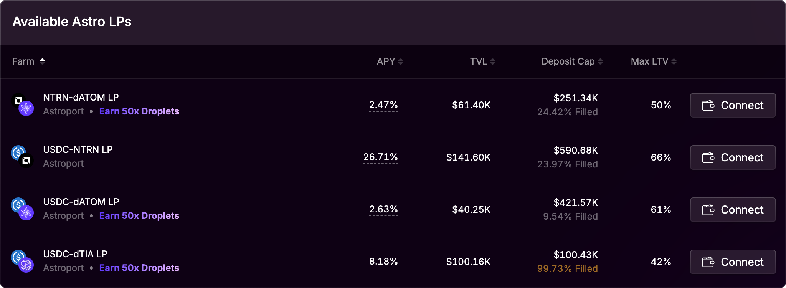
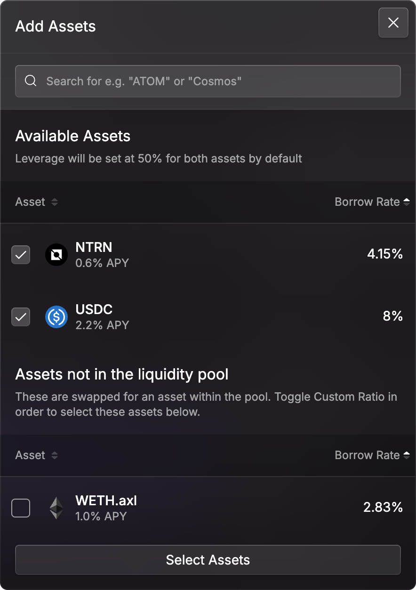
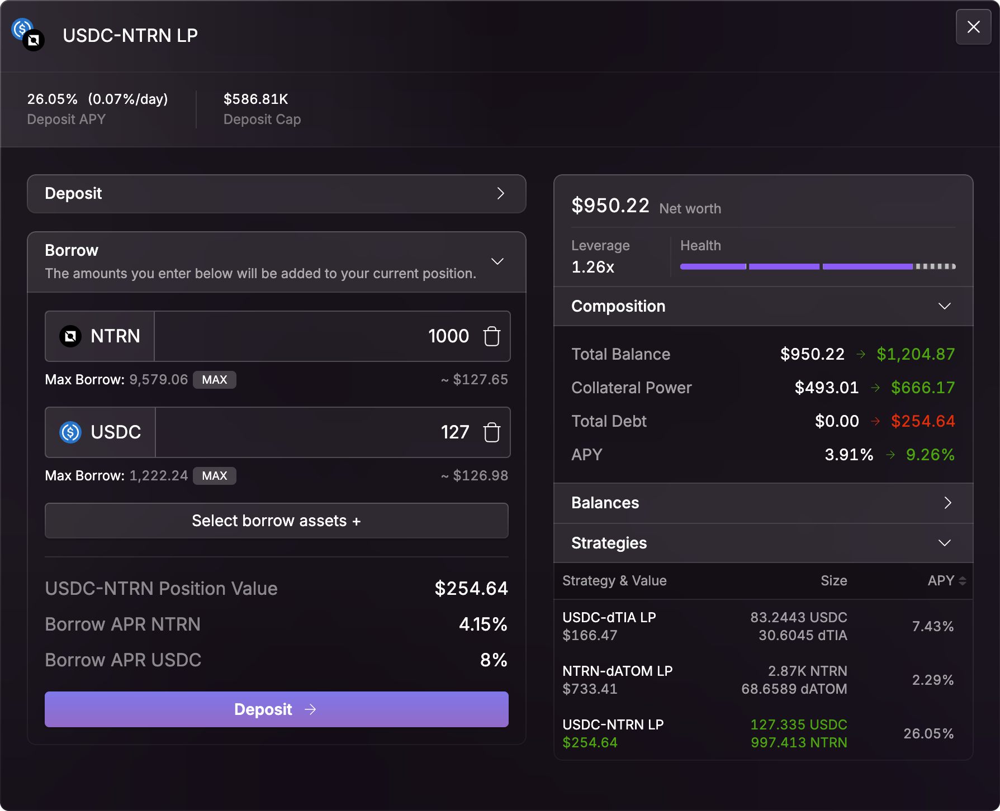
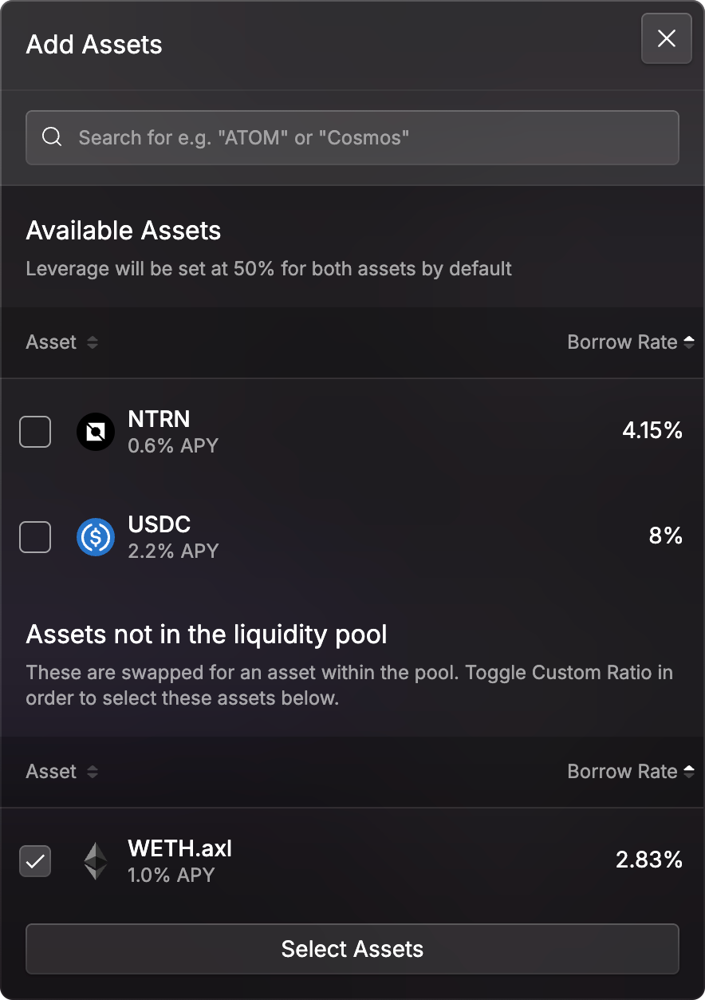
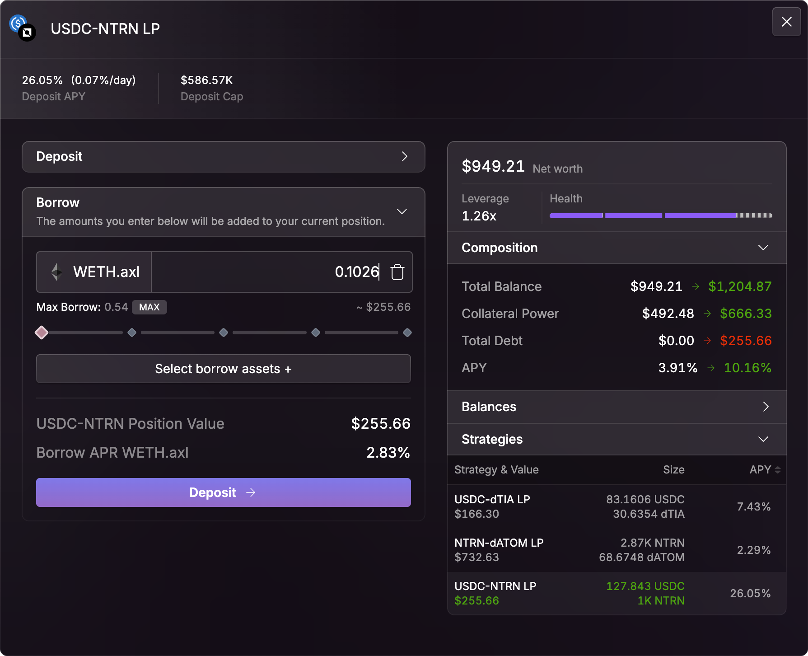

# Leveraged Yield Farming

This powerful strategy allows users to deploy capital more efficiently by using **LP tokens as collateral**, amplifying exposure to yield opportunities through leverage.

<figure><figcaption></figcaption></figure>

## Core Concept

**Liquidity provision is foundational to DeFi.** When users supply liquidity to a pool on Astroport, they receive **LP tokens**, which represent their share of the pool. These tokens accrue **trading fees** and are often **incentivized** through emissions programs and third-party rewards.

To enhance capital efficiency, Mars Protocol has **whitelisted Astroport LP tokens** as valid collateral within its **Credit Accounts**. Users can use these tokens to:

* Borrow assets to enter LP positions
* Leverage existing positions for higher yield
* Optimize collateral deployment across the broader Mars ecosystem

***

### How Leveraged Yield Farming Works

Users can employ various strategies to join Astroport liquidity pools with leverage:

1. **Borrow the underlying LP assets** (e.g., USDC and NTRN) directly
2. **Borrow a different asset** (e.g., WETH.axl) and use Astroport’s mechanisms to enter the pool via **single-sided liquidity provisioning**

The borrowed capital is automatically swapped (if needed) and used to provide liquidity, increasing the user's exposure to LP rewards while maintaining a single, consolidated Credit Account.

Thanks to Mars’ **cross-collateralized architecture**, users are not restricted to matching the pool’s native asset pair. This flexibility significantly **reduces borrow costs**, simplifies transactions, and increases access to yield farming strategies.

***

### Astroport Integration on Neutron

Mars Protocol’s leveraged yield farming is currently **live on Neutron** through its integration with **Astroport**. This integration offers several key advantages:

#### Key Benefits:

* **Custom Ratio Provisioning:**\
  Unlike traditional AMMs (e.g., Apollo Vaults on Osmosis), Astroport allows **asymmetric liquidity deposits**, meaning users can supply liquidity in any asset ratio—or even **single-sided**.
* **Reduced Transaction Overhead:**\
  No additional swap transaction is needed when supplying in a custom ratio. This results in **lower gas costs** and improved capital efficiency.
* **Protocol Incentives:**\
  Astroport supports LP incentives through:
  * **ASTRO token emissions**, driven by governance votes
  * **Third-party rewards**, attracting deeper liquidity to selected pools

***

## Strategy Examples

### 1. **Borrowing Underlying LP Assets**

<figure><figcaption>
Borrowing NTRN and USDC for the LP
</figcaption></figure> <figure><figcaption>
Credit Account APY increases from 3.91% to 9.26%
</figcaption></figure>

A user borrows **USDC and NTRN** to enter the **USDC-NTRN LP pool**:

* **Borrow Rates:**
  * USDC: 8.00%
  * NTRN: 4.15%
* **LP APY:** 26.05%
* **Initial Account APY:** 3.91%
* **Post-Strategy Account APY:** **9.26%**

By borrowing both LP assets, the user fully leverages the LP position and captures enhanced yield through the pool’s incentives.

***

### 2. Borrow Rate Optimization Strategy

<figure><figcaption>
Borrowing WETH.axl for the LP
</figcaption></figure> <figure><figcaption>
Credit Account APY increases from 3.91% to 10.16%
</figcaption></figure>

Instead of borrowing the native LP assets, the user borrows **WETH.axl**, which has a lower **borrow rate of 2.83%**. Upon entering the LP:

* The borrowed **WETH.axl** is **automatically swapped** into one of the LP assets.
* **Single-sided liquidity provisioning** is used to minimize transaction complexity and gas usage.
* **LP APY:** 26.05%
* **Initial Account APY:** 3.91%
* **Post-Strategy Account APY:** **10.16%**

This strategy improves yield performance over the previous example by **optimizing for the lowest borrow rate**, demonstrating the flexibility and capital efficiency enabled by Mars Protocol’s integration with Astroport.

***

## Summary

| Feature                       | Description                                                            |
| ----------------------------- | ---------------------------------------------------------------------- |
| **Platform Integration**      | Astroport on Neutron                                                   |
| **LP Collateralization**      | LP tokens accepted as collateral in Credit Accounts                    |
| **Single-Sided Provisioning** | Supported by Astroport to reduce swaps and gas costs                   |
| **Borrowing Flexibility**     | Users can borrow LP assets or alternative tokens                       |
| **Yield Optimization**        | Increased LP exposure enhances farming returns through leverage        |
| **APY Impact**                | Leverage boosts Credit Account APY significantly when properly managed |

**Leveraged Yield Farming on Mars Protocol** combines the power of on-chain leverage with efficient liquidity provisioning and incentive farming. By integrating directly with Astroport, Mars offers a seamless and flexible path to optimized yield strategies - backed by a robust risk and collateral model.

If LP asset pairs are **highly correlated**, they may also qualify for **High Leverage Strategies (HLS)**, enabling even greater capital efficiency.


[high-leverage-strategies.md](high-leverage-strategies.md)


***

## Tutorials


Leveraged Yield Farming



Droplets farming



LP as collateral iin the Droplet Campaign

