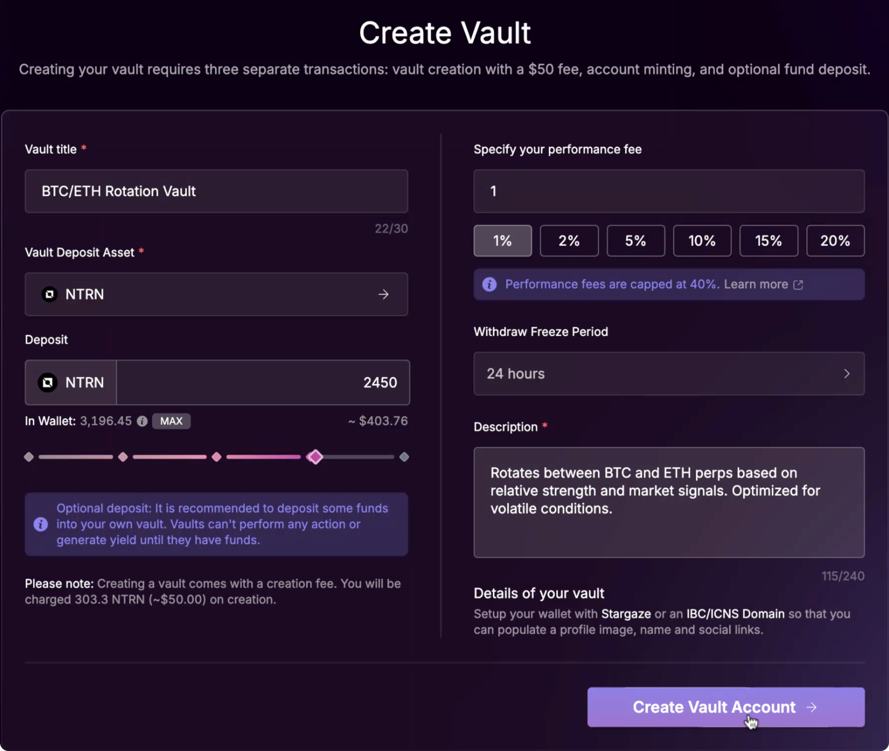
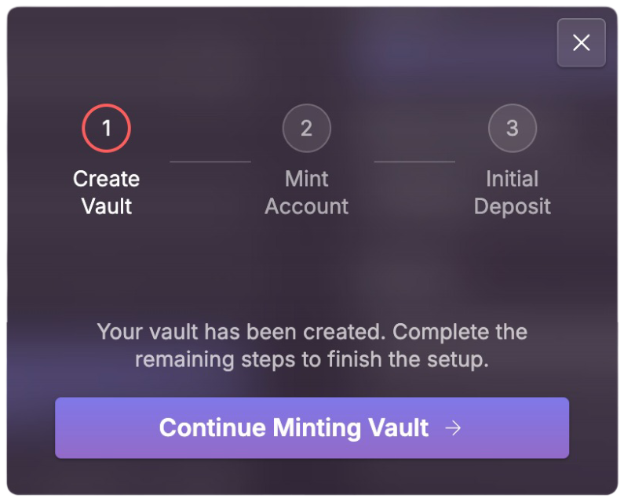

# Creating a Vault

As a vault manager, you can execute trades using your vault’s account, but you **cannot withdraw or transfer** deposited assets directly.\
In return for managing the strategy, you earn a **performance fee** — a percentage of the vault's profit, that is claimable monthly.

This guide walks you through the steps to create and manage a Vault using the Mars App interface. You’ll learn how to:

* Set up your vault’s parameters (title, fee, lockup period, etc.)
* Optionally seed your vault with an initial deposit
* Finalize vault creation and start managing assets

***

**Note:**

* A **$50 creation fee** is charged in the selected deposit asset at the time of vault creation.
* It is recommended vaults **are funded** upon creation in order to appear in the public vault listings. Unfunded vaults will remain hidden.

***

Here’s what the **Create Vault** screen looks like in the Mars App:

> This screen allows you to configure your vault’s title, asset, initial deposit, performance fee, and withdrawal lockup period.

<figure><figcaption></figcaption></figure>

Add a Clear Strategy Description

When filling in the **description** field during vault creation, it's important to clearly explain the strategy your vault will follow.

A good description helps depositors understand what they’re investing in, how the strategy works, and what to expect in terms of risk or asset focus.

> **Example:**\
> “Rotates between BTC and ETH perpetuals based on relative strength and market signals. Optimized for volatile market conditions.”

Avoid vague descriptions like “trading stuff” or “DeFi plays.” The more transparent and specific you are, the more likely users will trust and deposit into your vault.

#### **Optional: Personalize your vault**

You can connect your **Stargaze profile** or **IBC/ICNS Domain** to display a profile picture, social links, and ENS-style name alongside your vault. This adds credibility and helps depositors connect with your strategy.

***

### **Finalizing Your Vault**

Once you're happy with your vault’s configuration - including its title, strategy description, performance fee, lockup period, and initial deposit - you can proceed with the creation process.

Creating a Managed Vault requires **up to three on-chain transactions**:

1. **Vault Creation** – Deploys the vault and saves its parameters
2. **Vault Account Minting** – Sets up the credit account tied to the vault
3. **Initial Deposit** _(optional)_ – If you choose to deposit during creation

You’ll be prompted to approve each step in your wallet.

**After creation is complete**, you’ll be redirected to your vault’s dedicated management page. From there, you can begin monitoring performance and executing your trading strategy.

If you funded the vault during creation, it will also appear on the main public vaults listing. Unfunded vaults will remain hidden.

***

### Resuming an Incomplete Vault Setup

If you approve the **first transaction** (Vault Creation) but drop out before completing the process (Vault Account Minting or Deposit), don’t worry — your progress is saved.

* A **"Continue Setup"** button will appear the next time you visit:
  * The **Create Vault** page
  * Or your **My Vaults** table
* This allows you to finish setting up your vault without re-entering the details.

> The initial transaction already charged the **$50 creation fee** and saved your vault parameters on-chain.\
> You will **not be charged again**. You only need to complete:

1. Vault Account Minting
2. (Optional) Initial Deposit — if you had selected it

Once these are done, your vault will be fully functional and, if funded, listed publicly.

<figure><figcaption></figcaption></figure>

***

**Note:**

The **vault title, deposit asset, description, and withdrawal lockup period** cannot be changed after creation.

You can still adjust the **performance fee** later - but only once per month, typically during the performance fee claim window.
