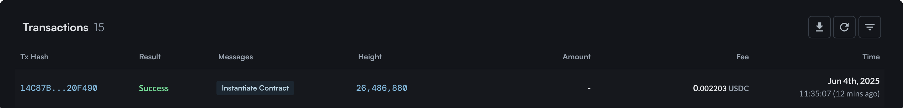

# How to Resume Vault Creation After Timeout

## Introduction

If you encounter the following error during vault creation:

> “Transaction with ID `{TX_ID}` was submitted but was not yet found on the chain. You might want to check later. There was a wait of 15 seconds.”

This indicates that your transaction **timed out during the instantiation** of the vault. While the transaction may have succeeded on-chain, the app lost track of it due to latency or network issues.

Instead of restarting the process entirely, you can **manually resume vault creation** by recovering the contract address and proceeding with a dedicated resume flow.

contract address and proceeding with a dedicated resume flow.

***

### Step-by-Step Guide

#### Step 1: Locate the Vault’s Contract Address

1. Open the [Mars App](https://app.marsprotocol.io/) and click the **wallet icon** in the top-right corner.

<figure><figcaption><p>Click on the View on Mintscan button to open your wallet in the Block Explorer</p></figcaption></figure>

2. Click the **“View on Mintscan”** button to open your account details in Mintscan.
3. Scroll down to the **Transactions list** and look for the most recent transaction with the **message type `Instantiate Contract`**. Click on it to view details.

<figure><figcaption><p>Find a transaction like this and click on it.</p></figcaption></figure>

> **Note:**\
> If there is **no transaction** with the message `Instantiate Contract`, your transaction might not have reached the chain at all. In this case, it's safe to **restart the creation process** from the beginning.

4. In the transaction detail view, scroll down to the **`#1. Instantiate Contract`** section.

<figure><figcaption><p>The instantiation details are located at the very bottom of the Transaction details</p></figcaption></figure>


4. Under the **Instantiates:** field, locate the value labeled `contract_address`.
5. Hover over the address and click the **copy icon** to copy the vault’s contract address.

<figure><figcaption><p>Click on the copy icon on the right side of the value</p></figcaption></figure>

***

#### Step 2: Resume Vault Creation

Once you have copied the vault contract address, you can resume creation using the resume page:

```plaintext
plaintextKopierenBearbeitenhttps://app.marsprotocol.io/vaults/resume/{VAULT_ADDRESS}
```

1. Replace `{VAULT_ADDRESS}` with the address you just copied.
2. Paste the updated URL into your browser and press Enter.
3. Follow the on-screen instructions to complete your vault setup.

***

### Summary

In the event of a transaction timeout during vault instantiation, your vault may still be live on-chain. By locating the contract address and visiting the dedicated resume page, you can seamlessly continue the setup process without starting over.\
