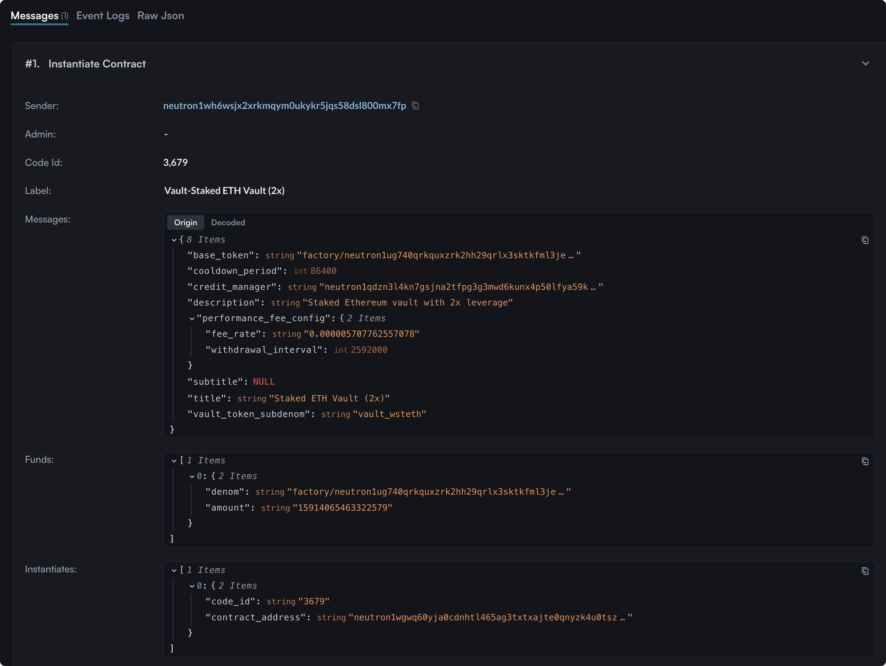

# How to Resume Vault Creation

## If You Didn’t Finish Vault Setup

If you approve the **first transaction** (Vault Creation) but drop out before completing the process (Vault Account Minting or Deposit), don’t worry — your progress is saved.

* A **"Continue Setup"** button will appear the next time you visit:
  * The **Create Vault** page
  * Or your **My Vaults** table
* This allows you to finish setting up your vault without re-entering the details.

> The initial transaction already charged the **$50 creation fee** and saved your vault parameters on-chain.\
> You will **not be charged again**. You only need to complete:

1. Vault Account Minting
2. (Optional) Initial Deposit — if you had selected it

Once these are done, your vault will be fully functional and, if funded, listed publicly.

If you decide not to continue, you can **delete** the draft vault from the same “Continue Setup” dialog.

* This action is **irreversible**.
* Any fees already paid (e.g., the $50 creation fee) **will not be refunded.**

<figure><figcaption></figcaption></figure>

***

## What if a Transaction Timed Out?

If you encounter the following error during vault creation:

> “Transaction with ID `{TX_ID}` was submitted but was not yet found on the chain. You might want to check later. There was a wait of 15 seconds.”

This indicates that your transaction **timed out during the instantiation** of the vault. While the transaction may have succeeded on-chain, the app lost track of it due to latency or network issues.

### Resume the Vault Creation

Instead of restarting the process entirely, you can **manually resume vault creation** by recovering the contract address and proceeding with a dedicated resume flow.

***

## Step-by-Step Guide

### Step 1: Locate the Vault’s Contract Address

1. Open the [Mars App](https://app.marsprotocol.io/) and click the **wallet icon** in the top-right corner.

<figure><figcaption>
Click on the View on Mintscan button to open your wallet in the Block Explorer
</figcaption></figure>

2. Click the **“View on Mintscan”** button to open your account details in Mintscan.
3. Scroll down to the **Transactions list** and look for the most recent transaction with the **message type `Instantiate Contract`**. Click on it to view details.

<figure><figcaption>
Find a transaction like this and click on it.
</figcaption></figure>

> **Note:**\
> If there is **no transaction** with the message `Instantiate Contract`, your transaction might not have reached the chain at all. In this case, it's safe to **restart the creation process** from the beginning.

4. In the transaction detail view, scroll down to the **`#1. Instantiate Contract`** section.

<figure><figcaption>
The instantiation details are located at the very bottom of the Transaction details
</figcaption></figure>

4. Under the **Instantiates:** field, locate the value labeled `contract_address`.
5. Hover over the address and click the **copy icon** to copy the vault’s contract address.

<figure><figcaption>
Click on the copy icon on the right side of the value
</figcaption></figure>

***

### Step 2: Resume Vault Creation

Once you have copied the vault contract address, you can resume creation using the create vault page:


Create Vault Page


1. Click on the _Contine Setup_ button inside the [Create Vault Page](https://app.marsprotocol.io/vaults/create).

<figure><figcaption>
Click on Continue Setup
</figcaption></figure>

Alternatively use the _Continue Setup_ button in the [_My Vaults_ Table](https://app.marsprotocol.io/vaults).

2. Insert the copied Vault Address into the modal, that shows after clicking on the _Continue Setup_ button.

<figure><figcaption>
Copy the vault address into the input field
</figcaption></figure>

3. Click on _Continue Minting Vault_ and you will be able to resume the minting process.

***

### Summary

In the event of a transaction timeout during vault instantiation, your vault may still be live on-chain. By locating the contract address and visiting the _Create Vault_ page, you can seamlessly continue the setup process without starting over.\
