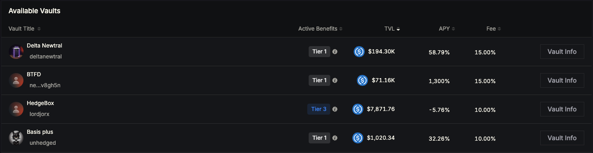
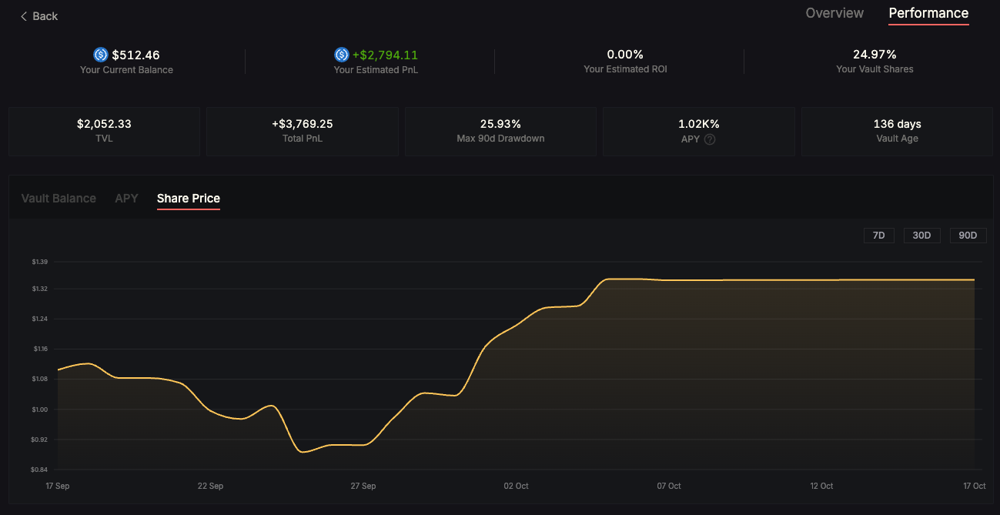

# Depositing into Vault

Managed Vaults on Mars Protocol allow you to passively participate in a trading strategy run by a vault manager. In return for your deposit, you receive vault shares that represent your portion of the vault and its performance over time.

This guide walks you through what to check before depositing, how it works, and what to expect after you've entered a vault.

***

### Finding a Vault&#x20;

All available vaults are listed in a **sortable table** on the main **Vaults page**.

Each row displays:

* **Vault Title** – The custom name set by the manager
* **Manager Identity** – Either a profile name (if set via Stargaze) or a shortened address
* **TVL** – Total value locked in the vault
* **APY** – Current annualized return (based on vault performance)
* **Fee** – The performance fee charged by the manager
* **Vault Info** – A button to inspect the vault in detail

> You can **sort** the list by TVL, APY, or fee to find vaults that match your risk appetite or yield target.

<figure><figcaption></figcaption></figure>

Click the **Vault Info** button to view full details, including strategy, past performance, and deposit options.

***

### Inspecting a Vault

Before depositing, you should always review the vault’s:

* **Strategy description** – Understand what the manager is doing with your funds.
* **Health & Position Metrics** – Includes leverage, risk level, open positions, and exposure.
* **Performance tab** – Shows historical data such as:
  * Vault balance
  * Share price evolution
  * Historical APY
  * Vault age
  * Max 90-day drawdown - largest value drop over any 90-day period
  * Total PnL - total profit or loss generated since vault inception

> **Note:** Vault managers take a **performance fee**, which is a cut of the profits they generate. You can see the fee percentage on the vault’s summary panel.

> **Note on APY:**\
> The APY displayed is based on a **30-day rolling average** of the vault’s performance.\
> If a vault is **less than 30 days old**, the APY may appear volatile or unrepresentative until sufficient historical data is collected.

***

### DYOR (Do Your Own Research)

Always make informed decisions. Take time to:

* Understand the strategy
* Review the manager’s trading history and transparency
* Check vault risk metrics
* Consider the withdrawal freeze period (lockup time)

***

### Depositing Funds

When you're ready to deposit:

* Funds are pulled **directly from your connected wallet**
* Your **Credit Account is not involved**
* In return, you receive **vault shares**, which are:
  * Proportional to your deposit
  * **Transferable**
  * Redeemable later for the base asset

***

### Withdrawing Funds

To exit a vault:

1. Click **Unlock** to start the withdrawal timer
2. After the **freeze period ends**, you can click **Withdraw**

> If you have **multiple unlocked positions**, clicking **Withdraw** will process **all of them in a single transaction**.

***

### My Vault Position

Once you've deposited into a vault, you'll gain access to a detailed breakdown of your personal position via the **Performance tab**. This section helps you track how your share in the vault has evolved over time.

Here’s what you’ll see:

*   **Your Balance**\
    The current value of your vault shares, denominated in the vault’s base asset (e.g., USDC or NTRN).

    > This value fluctuates based on both the vault’s performance **and** the market price of the base asset.\
    > For example, if the vault is denominated in NTRN, your balance in USD terms may change even if your share count stays the same — due to changes in NTRN’s price.
* **Total PnL**\
  The cumulative profit or loss generated by your position in the vault.
*   **ROI (Return on Investment)**\
    Expressed as a percentage, this shows your personal performance since the time of deposit.

    > For example, if you deposited $500 and your balance is now $550, your ROI is +10%.
* **Vault Share %**\
  Shows how much of the total vault you currently own.\
  This is determined by the number of vault shares you hold versus the total vault share supply.

<figure><figcaption></figcaption></figure>

> **Reminder:**\
> Managed Vaults are not entirely “set and forget.” You’re still responsible for monitoring your position over time.\
> Keep an eye on the vault’s strategy, positions, and risk metrics — especially if market conditions change.\
> While vault managers trade on your behalf, you should stay informed and reassess your deposit if needed.

***

### My Deposits

Any vaults where you have a deposit will appear in a separate **“My Deposits”** table at the top of the main Vaults page. This makes it easy to keep track of all your positions across different strategies.

From here, you can monitor your vault performance, initiate withdrawals, or explore other vaults to diversify your exposure.

