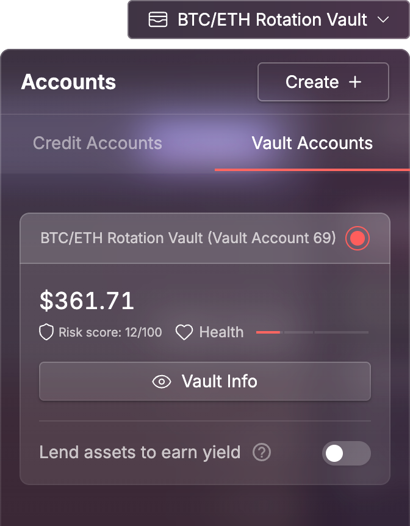

# Managing a Vault

After successfully creating your Vault, you’ll be redirected to its management dashboard. This is your control center for monitoring performance, managing positions, and preparing for withdrawals.

You can return to this page anytime via the **vault page**, your **portfolio**, or by selecting the vault from the **Credit Account dropdown menu**.

> This screen provides a live overview of your vault’s performance, withdrawal status, and available management actions.

<figure><figcaption></figcaption></figure>

### Key Areas of the Vault Dashboard

Here are the key elements you'll find on the vault dashboard:

* **Vault Summary (left panel)**\
  Shows your vault’s title, description, APY, total value locked (TVL), performance fee %, and the withdrawal freeze period. It also includes your Stargaze-linked identity (if connected).
*   **Performance Fee Panel (top panel)**

    Shows how much in fees you’ve earned. You can only claim performance fees **once per month** — typically during a claim window. A **Claim** button will be enabled when eligible.

    > **Note:** The displayed fee amount is based on the vault’s **accrued PnL**, which only updates when a user **deposits into or withdraws from the vault**. If there’s no user activity, the value may appear unchanged even if your positions are profitable.

* **Deposit / Unlock Buttons**\
  You can deposit additional funds into your own vault or unlock funds if you’ve previously deposited.
*   **Withdrawal Activity Tabs**\
    This section is split into three tabs, helping you track and manage vault withdrawals and liquidity. You should monitor it closely to ensure your vault can fulfill queued withdrawals.                                    **1. Withdrawal Summary**

    Provides a snapshot of your vault’s ability to fulfill user withdrawals. You should monitor this closely.

    Includes:

    * **Depositor Withdrawal Period** – The lockup duration before users can withdraw
    * **Queued Withdrawals** – Number of active user withdrawal requests
    * **Total Withdrawal Value** – Combined value of all pending withdrawals
    * **Vault Balance** – How much of the deposit asset is available
    *   **Accrued PnL** – Profit/loss since the last performance fee withdrawal

        > Updates only on user interactions (e.g., deposits/withdrawals)
    *   **Queued Withdrawals vs. Vault Balance** – Shows how much has been requested for withdrawal vs. how much of the deposit asset is available.

        > If there's a shortfall, the system will **automatically borrow the asset from the Red Bank** to fulfill the withdrawals. It's your responsibility to monitor this and prepare accordingly.

    **2. Queued Withdrawals**

    A list of all pending withdrawal requests submitted by users.

    **3. My Withdrawals**

    Shows only your personal pending withdrawals (if you’ve deposited into your own vault).

    > **Note:** Once the withdrawal timeout expires, a **Withdraw** button will be enabled.\
    > If you have **multiple unlocked positions**, clicking this button will **withdraw all of them at once** into your wallet — **with just a single transaction to sign**.

* **Health & Position Metrics (bottom panel)**\
  Displays key risk indicators such as health factor, leverage, total position value, debt, and current position APY.

> If your vault has any active positions, the bottom panel will display additional tabs such as Summary, Balances, and Perps Positions.

<figure><figcaption></figcaption></figure>

### Claiming & Editing Your Performance Fee

As a vault manager, you earn a performance fee based on profits generated by your strategy. You can claim and optionally update this fee, but both actions have some important rules.

#### Claiming Your Fee

* You can claim your performance fee **once per month**, during a designated **claim window**.
* The fee is paid in the **base token** you selected when creating the vault (e.g. USDC).
* If your vault has not generated any profit since the last claim, no fee will be available to withdraw.

> **Note:** The claimable amount only updates when someone interacts with the vault (e.g. deposits or withdrawals). If there’s no user activity, it may appear unchanged even if your positions are profitable.

#### Editing Your Fee

* You can change your performance fee at any time, but only **once per month**.
* When you submit an update, any **accrued fee will be withdrawn automatically** as part of that transaction.
* The maximum allowed fee is **40%** — anything above will be rejected.

> **Tip:** If you're planning to adjust your fee, time it strategically around your next claim window.

<figure><figcaption></figcaption></figure> <figure><figcaption></figcaption></figure>

### Trading with the Vault

To begin executing your strategy, click the **Manage Vault** button from the vault dashboard. This will take you to the Mars trading interface with your vault account **preselected** for trades, ensuring that all trades you perform are on behalf of the vault — not your personal wallet.

You can also **quickly switch between vaults** — just like you do with your Credit Accounts — using the **Accounts dropdown** in the top navigation.

<figure><figcaption></figcaption></figure>
