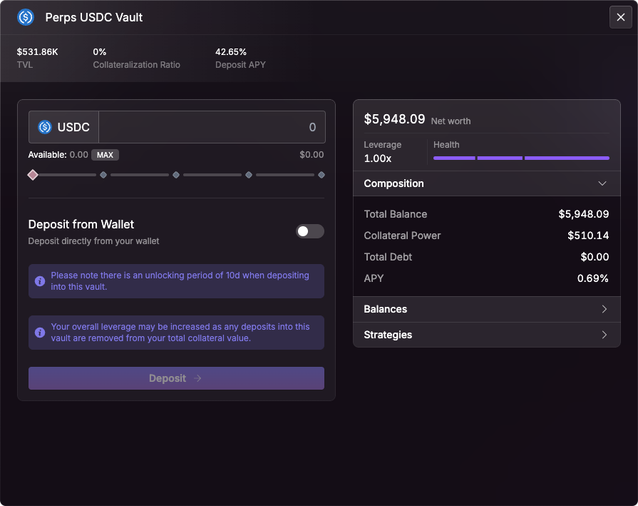

# Perps Vault (Counterparty Vault)

It plays a critical role in ensuring reliable **USDC-based settlement**, effective risk management, and long-term system sustainability.

<figure><figcaption></figcaption></figure>

### Core Function

Unlike traditional perpetual futures platforms that match users against each other (peer-to-peer), Mars Protocol operates a **vault-based counterparty model**. All trades—long or short—are executed **against the Perps Vault**, which holds and redistributes USDC for trade settlements.

This design enables:

* Deterministic, oracle-based pricing
* Simplified trade matching
* Efficient PnL settlement

***

### PnL Settlement Mechanics

The Perps Vault is responsible for managing **Profit and Loss (PnL) settlement flows** between itself and users' Credit Accounts:

* **Positive PnL (User Profit):**\
  The vault pays out **USDC** to the user's Credit Account when the user closes a profitable position.
* **Negative PnL (User Loss):**\
  Losses are deducted from the user’s Credit Account and transferred to the vault.
  * If the account does **not have enough USDC**, the shortfall is **automatically borrowed from the Red Bank**, Mars Protocol’s decentralized money market.

This mechanism ensures **smooth settlement** even when accounts are undercollateralized in USDC, maintaining trading continuity.

***

### Deposit Lock-Up Policy

*   **Lock-Up Period:**\
    All deposits into the Perps Vault are subject to a **10-day lock-up period**.

    This measure:

    * Provides **predictable liquidity** for settlement needs
    * Reduces volatility in vault capacity
    * Protects against sudden liquidity withdrawals that could compromise systemic integrity

***

### Revenue Share Participation

The Perps Vault is **incentivized** to provide liquidity and absorb trade risk through a **revenue-sharing model**:

* It receives a **portion of perpetual trading fees** collected on the platform.
* These fees are denominated in **USDC** and accrue over time, bolstering the vault’s capital reserves and enabling long-term participation.

This revenue stream also aligns the vault’s sustainability with the health and growth of the Mars Perpetual Futures ecosystem.\
\
Perpetuals on Mars charge a **0.075% fee per trade**. This fee is split between liquidity providers and the protocol:

* **75%** goes to **Perps Vault depositors**, rewarding them for providing settlement liquidity.
* **25%** goes to **protocol revenue**, supporting long-term sustainability and development.

***

### Daily APY

It reflects the daily interest generated from the vault’s accrued trading fees. It varies with platform activity, offering compounded returns to **Liquidity Providers (LPs)** through the **revenue-sharing model.**

<figure><figcaption></figcaption></figure>

#### APY Calculation:

<figure><figcaption></figcaption></figure>

* PT = today’s average share-price
* PT−30 = average share-price 30 days ago

***

### Summary

| Feature              | Description                                    |
| -------------------- | ---------------------------------------------- |
| **Role**             | Acts as counterparty to all Perp trades        |
| **Settlement Asset** | USDC                                           |
| **Positive PnL**     | Paid from vault to user's Credit Account       |
| **Negative PnL**     | Collected from user or borrowed from Red Bank  |
| **Deposit Lock-Up**  | 10-day period                                  |
| **Fee Revenue**      | Receives share of 0.075% trading fee per trade |

***

The Perps Vault is a cornerstone of Mars Protocol’s Perpetual Futures system, enabling **non-custodial, oracle-priced, and capital-efficient trading** with robust liquidity and settlement guarantees.
