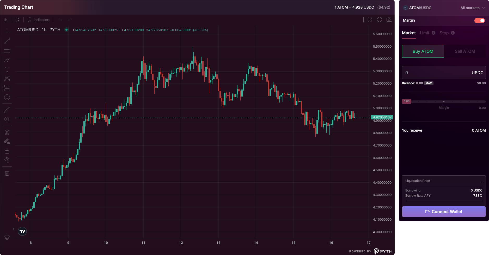

# Spot & Margin Trading

These functions are unified within the **Credit Account system**, allowing users to interact with the protocol in a capital-efficient and user-friendly way.

<figure><figcaption></figcaption></figure>

### Spot Trading

**Spot Trading** on Mars refers to the **direct exchange of one asset for another** using the funds already available in a user's Credit Account. It does not involve leverage, borrowing, or margin mechanics.

* Users simply **swap** an asset (e.g., USDC for ATOM) at the current market rate.
* All trades are executed through **integrated decentralized exchanges (DEXs)**.
* No risk of liquidation exists, as the trade only involves assets the user already owns.

This mechanism mirrors conventional DEX trading but benefits from Mars’ **unified collateral model** and smooth interface.

***

### Margin Trading

**Margin Trading** enables users to trade with **leverage**—meaning they can take on positions **larger than their current account balance** by borrowing additional assets from the Mars money market (Red Bank).

For example:

* A user with **100 USDC** in their Credit Account may open a **500 USDC** position on ATOM by borrowing **400 USDC**.
* This leveraged exposure amplifies both **potential profits** and **potential losses**.

***

### Why Mars is Different

Traditional DeFi platforms often require a multi-step "looping" strategy to achieve leverage:

1. Deposit collateral
2. Borrow a second asset
3. Swap the borrowed asset
4. Repeat to compound leverage

This approach is:

* **Capital-inefficient**, locking up additional assets with each loop
* **Gas-intensive** and requires manual, error-prone steps

Mars Protocol introduces a superior model:

#### Capital Efficiency & UX Advantages

* **One-Click Leverage**\
  Margin trades are executed in a **single transaction**, with collateral, borrowing, and swapping handled atomically.
* **Unified Credit Accounts**\
  All assets deposited into a Credit Account act as **cross-collateral**, maximizing margin availability without requiring asset segregation.
* **Seamless Protocol Integration**\
  No interaction with multiple contracts or external protocols is needed. Users engage in leveraged trading directly within the Mars interface.

***

### Understanding Leverage Risk

While margin trading offers significant upside, it also introduces **elevated risk**, particularly **liquidation risk**.

#### Liquidation Risk

If the value of your collateral falls too far relative to your borrowed position, your Credit Account can be **liquidated**:

* Liquidation is triggered when the **health factor** of the account falls to **1.0 or below**.
* Mars Protocol provides an **estimated liquidation price** for each position, helping users manage risk proactively.

#### Liquidation Price Dynamics

In simple accounts (e.g., one leveraged position, stablecoin debt), the **liquidation price estimate is reliable**.

However, liquidation prices can become more dynamic under the following conditions:

* The account holds **multiple positions**
* The borrowed asset is **volatile**, not a stablecoin
* Other **collateral or debt assets** fluctuate significantly in price

In these scenarios, small market movements can shift liquidation thresholds unpredictably. Thus, **regular monitoring of account health** and conservative leverage are strongly advised.

***

### Summary

| Feature        | Spot Trading            | Margin Trading                               |
| -------------- | ----------------------- | -------------------------------------------- |
| Feature        | <kbd>Spot Trading</kbd> | Margin Trading                               |
| **Execution**  | Swap at market price    | One-click margin execution                   |
| **Risk**       | None (self-funded)      | Subject to liquidation                       |
| **Use Case**   | Simple asset exchange   | Amplified exposure via borrowed funds        |
| **Collateral** | Funds in Credit Account | All whitelisted assets in the Credit Account |

***

**Spot and Margin Trading on Mars Protocol** are unified through a capital-efficient, user-friendly framework that simplifies DeFi trading while expanding access to advanced strategies—without compromising transparency or risk controls.

### Tutorial



