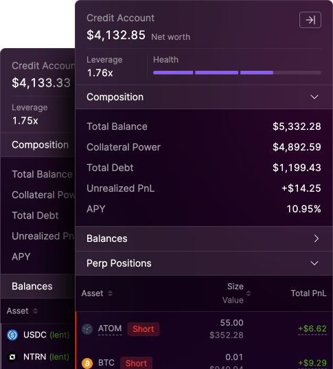

# The Credit Account

### Understanding Credit Accounts on Mars

<figure><figcaption></figcaption></figure>

To understand how a Credit Account works, let's break down some key concepts:

### Collateral vs. Debt

* **Collateral**: Assets you deposit into your Credit Account. These assets back your borrowing and trading activities.
* **Debt**: The amount you've borrowed against your collateral.

### Leverage and Risk

Taking leverage can amplify both gains and losses. It comes with risks, including the possibility of liquidation.

### Health Factor

The Health Factor is a crucial metric that determines the safety of your Credit Account.

* Your account is considered healthy when your (Adjusted) Collateral Value > Debt
* This relationship is expressed as the Health Factor
* A Health Factor > 1 means your account is healthy
* A Health Factor ≤ 1 means your account is at risk of liquidation

#### Health Factor Calculation

The Health Factor is calculated using this formula:

Health Factor = (Collateral Value \* LTV) / Debt

Where:

* Collateral Value: The total value of assets in your Credit Account
* LTV: Loan-to-Value ratio, which varies depending on the context (see MaxLTV and LiqLTV below)
* Debt: The total amount borrowed

### Risk Parameters: MaxLTV vs. LiqLTV

Mars Protocol uses two different LTV parameters to manage risk:

1. **MaxLTV (Maximum Loan-to-Value)**
   * Used when entering a new position
   * Determines how much you can borrow against your collateral
   * Applied in calculating the Account Health Factor for new positions
2. **LiqLTV (Liquidation Loan-to-Value)**
   * Used to determine if an existing position is at risk of liquidation
   * Applied in calculating the Account Health Factor for liquidation purposes
   * Generally Higher than MaxLTV

#### Why the Difference?

The difference between MaxLTV and LiqLTV provides a safety margin. If a user maxes out their leverage when entering a new position (using MaxLTV), small market movements won't immediately cause the account to be liquidated. The higher LiqLTV gives some buffer before liquidation occurs.

## Credit Account Example

Below is an example of a Credit Account, showing how collateral, debt, and health factors are calculated:

### Collateral Assets

| Asset | Position Size | Price    | Market Value | Max LTV | Liq LTV | CP MaxLTV | CP LiqLTV |
| ----- | ------------- | -------- | ------------ | ------- | ------- | --------- | --------- |
| BTC   | 5             | $100,000 | $500,000     | 70%     | 73%     | $350,000  | $365,000  |
| USDC  | 50,000        | $1       | $50,000      | 80%     | 82%     | $40,000   | $41,000   |

### Debt

| Asset | Position Size | Price  | Market Value |
| ----- | ------------- | ------ | ------------ |
| ETH   | 38            | $9,950 | $378,100     |

### Health Factors

| Metric                 | Value |
| ---------------------- | ----- |
| Health Factor (MaxLTV) | 1.03  |
| Health Factor (LiqLTV) | 1.07  |

#### Explanation:

1. **Collateral**: The account holds two assets as collateral - BTC and USDC.
   * CP MaxLTV: Collateral Power using Maximum LTV
   * CP LiqLTV: Collateral Power using Liquidation LTV
2. **Debt**: The account has borrowed 38 ETH, valued at $378,100.
3. **Health Factors**:
   * Using MaxLTV: 1.03 (slightly above the safe threshold of 1)
   * Using LiqLTV: 1.07 (provides a small buffer against liquidation)

The difference between MaxLTV and LiqLTV creates a safety margin, allowing for some market fluctuation before the account becomes at risk of liquidation.
